# This file helps you to understand what i do actually in this docker+springboot project

* So first , I initialize the project using spring initializer,
* Then next step is add/create Docker file as (Dockerfile) 
* In this file we actually do commands to create container | To build docker image 

## - Dockerfile instructions

- FROM eclipse-temurin:17  // for define base image or parent image
- LABEL mentainer="sandesh@gmail.com" // for defin maintainer or author
- WORKDIR /app // when we deployee docker image in docker container app directory created in container
- COPY target/spring-boot-docker-0.0.1-SNAPSHOT.jar /app/springboot-docker-app.jar // for copy project from local project to docker container
- ENTRYPOINT["java","-jar","springboot-docker-app.jar"]  // this is a entrypoint where project run into docker container 

## - Build Images And Run Container

* docker build -t spring-boot-docker .  ( . = indicates root folder)

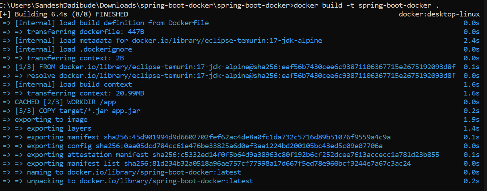

* View Docker images

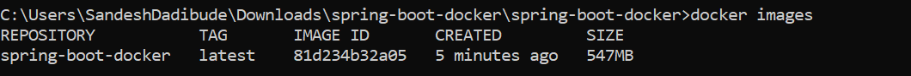

* Add Tag to image

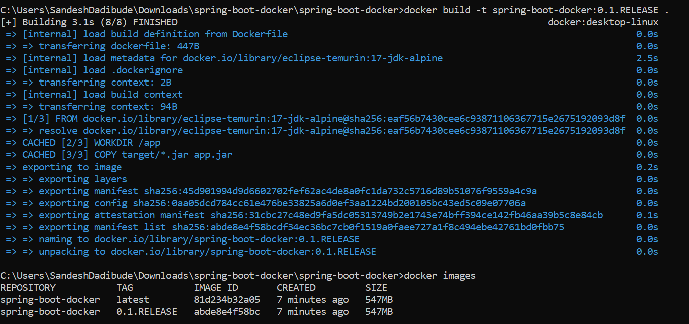

*  Run docker container | -p : for mapping port | (host machine port)8080:8080(container port)

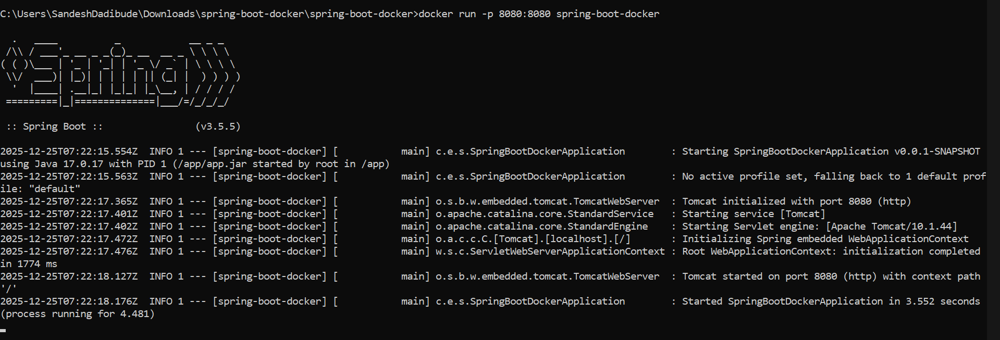

* Change port 

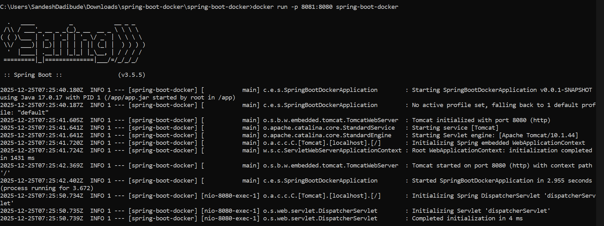

* View running containers 

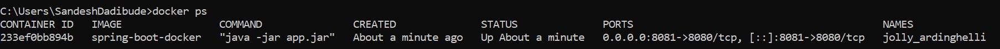

* Run Container in detached mode / Background mode (-d : detached mode )

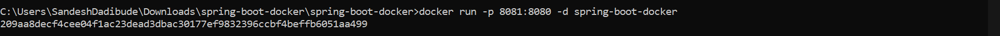

* View Longs 

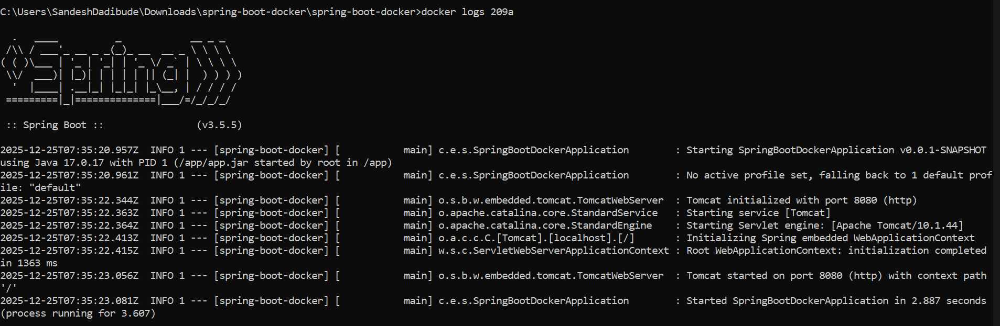

* Stop Container providing container id

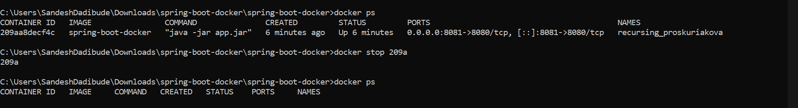

## - Push Image From local machine to Docker Hub 

* First login

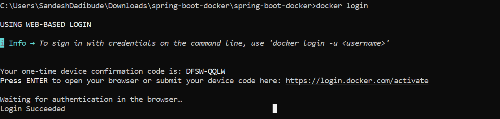

* Push image

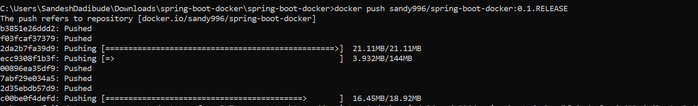

## Pull Images from Docker Hub

* Pull pushed image 

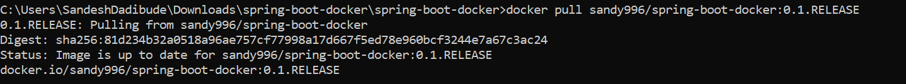

* Pull existing images

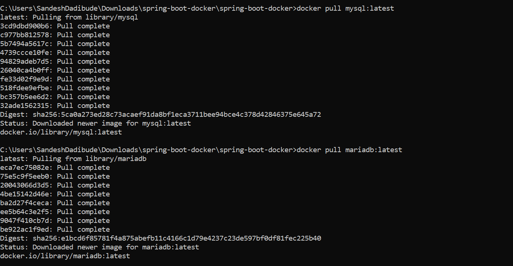

* List of images exist in local machine

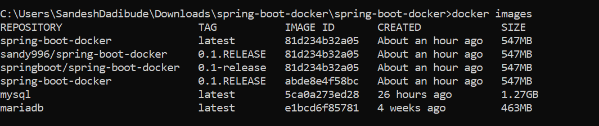

* Run container

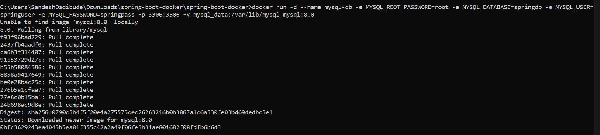

* View Logs

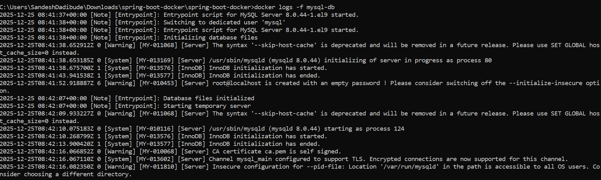

* Use Container

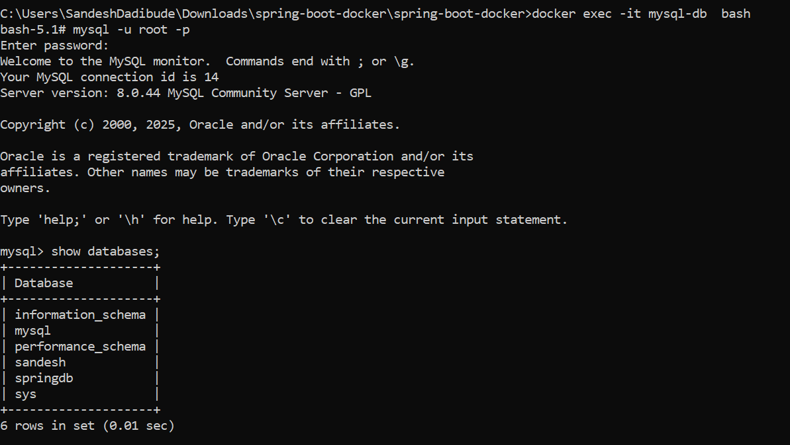

